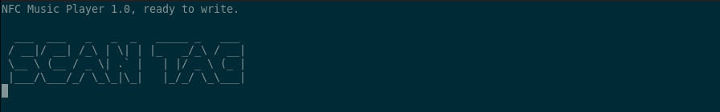
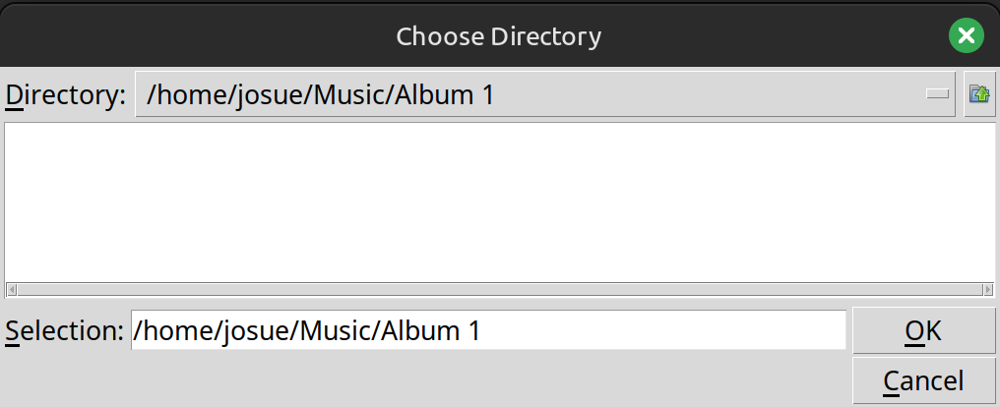
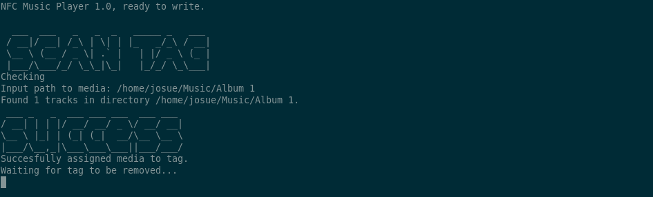
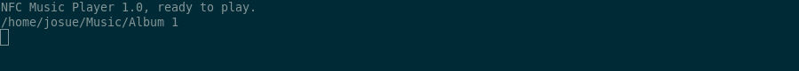

# NFC Player

Allows you to create a physical interface for your digital media library using NFC technology. This lets you have instant media playback by scanning NFC tags through a simple tag-to-file or tag-to-folder association. 

# Installation
```bash
git clone [repository-url]
```
## Write mode

### Writing tags when GUI is detected

1. Run in write mode:

```bash
python nfc_player.py -w -f "~/path/to/your/media/library/"
```
2. Scan Tag



If program detects GUI availability you will be prompted with a directory dialog box:
<picture></picture>

Otherwise you will be asked to input directly into terminal.

3. Done writing



4. Continue writing or quit with CTRL+C

## Batch Write Mode
 
This mode allows you to quickly write to a bunch of tags.

1. Prepare a file with media directories separated by newlines.
   ```
      /Music/Album1
      /Music/Album2
      /Music/Album3
   ```
2. Start program in quick scan mode with the ```-b``` flag followed by the location of your file.
3. Scan tag until you see the success message.
4. Repeat with next tag.

*If you want to skip a specific directory press CTRL+C*

## Playback Mode

```bash
python nfc_player.py
```
1. Enter playback mode and scan the tag



# Table of Contents
- [NFC Player](#nfc-player)
- [Installation](#installation)
  - [Write mode](#write-mode)
    - [Writing tags when GUI is detected](#writing-tags-when-gui-is-detected)
  - [Batch Write Mode](#batch-write-mode)
  - [Playback Mode](#playback-mode)
- [Table of Contents](#table-of-contents)
- [Requirements](#requirements)
  - [VLC Media player](#vlc-media-player)
  - [NFC Reader \& Tags](#nfc-reader--tags)
    - [NFC Reader](#nfc-reader)
      - [Windows](#windows)
    - [NFC Tags](#nfc-tags)
      - [Tag Size Considerations](#tag-size-considerations)
- [Usage](#usage)
  - [Command Line Options](#command-line-options)
- [Library Documentation](#library-documentation)

# Requirements

## VLC Media player

You'll need an installation of [VLC media player](https://www.videolan.org/vlc/) in order to use this application.

## NFC Reader & Tags

This application makes use of the [nfcpy](https://nfcpy.readthedocs.io/en/latest/index.html) library to read and write NFC tags. 

### NFC Reader

You'll need a compatible NFC reader:

- Check [*supported devices list*](https://nfcpy.readthedocs.io/en/latest/overview.html#supported-devices).

#### Windows 

If you're on windows you may need to install WinUSB and libusb, you can [follow the instructions in the nfcpy documentation](https://nfcpy.readthedocs.io/en/latest/topics/get-started.html?highlight=windows#installation). 

### NFC Tags

Tag compatibility depends on your reader:

- Verify nfcpy's [*tag support for your reader*](https://nfcpy.readthedocs.io/en/latest/overview.html#functional-support).

#### Tag Size Considerations

The response distance of your tags is proportional to the size and reader strength. The best way you can control the response distance is through tag size.

- Larger tags generally have better read range
- [Check out this video by seritag to see how distance affects reading.](https://www.youtube.com/watch?v=LELufh_XbN4)

# Usage

Scan a tag to instantly play media files associated to it.

## Command Line Options
|Flag|Description|
|---|---|
| -l | Location of NFC reader device. Default is "usb". |
| -w | Write Mode. Assign tags to a media folder. |
| -f | Default media directory for directory dialog box (write mode only). |
| -t | Terminal only mode, no dialog box for selecting directory. Must input directories for tags manually. |
| -b | Batch write mode. Load a list of media directories and assign tags to them. |
| -c | Check if paths in DB are valid and contain media, and print invalid/empty paths. |
| -v | Verbose output. |
| -d | Debug output. |

# Library Documentation
- nfcpy: https://nfcpy.readthedocs.io/en/latest/index.html