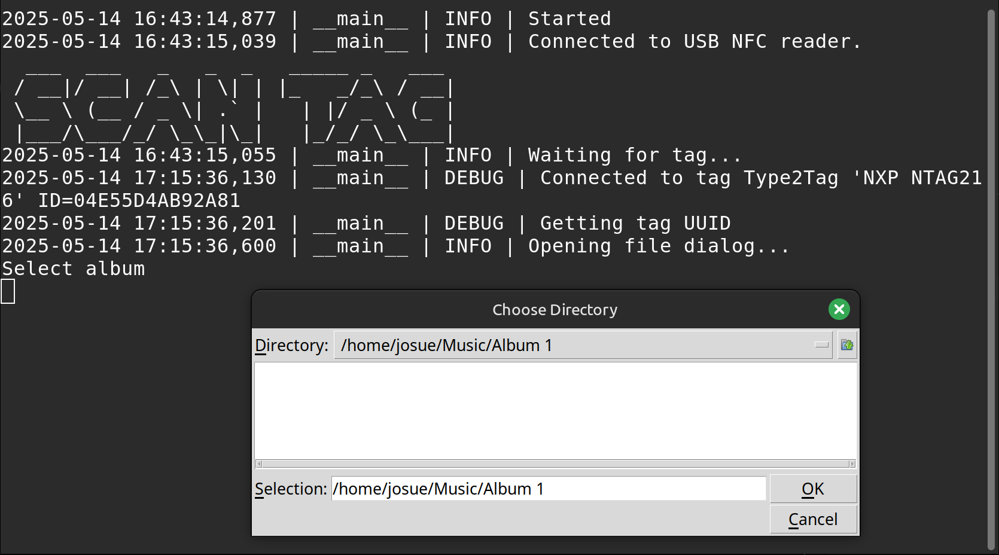
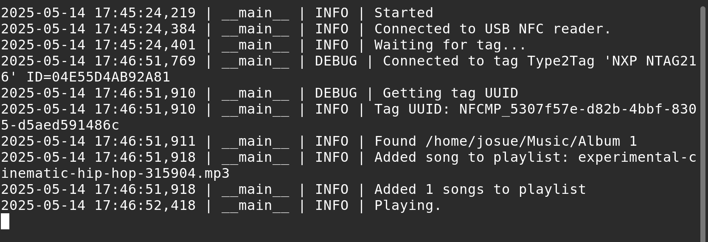

# NFC Player

Create a physical interface for your digital media library using NFC technology.

## Features
- Instant media playback by scanning NFC tags
- Simple tag-to-folder association
- Cross platform support (Windows/Linux/macOS)
- Lightweight Python implementation

## Installation
```bash
git clone [repository-url]
cd nfc-player
pip install -r requirements.txt
```

## Table of Contents
- [NFC Player](#nfc-player)
  - [Features](#features)
  - [Installation](#installation)
  - [Table of Contents](#table-of-contents)
  - [Requirements](#requirements)
    - [VLC Media player](#vlc-media-player)
    - [NFC Reader \& Tags](#nfc-reader--tags)
      - [NFC Reader](#nfc-reader)
        - [Windows](#windows)
      - [NFC Tags](#nfc-tags)
        - [Tag Size Considerations](#tag-size-considerations)
  - [Usage](#usage)
    - [Command Line Options](#command-line-options)
    - [Write mode](#write-mode)
      - [Writing tags](#writing-tags)
    - [Playback Mode](#playback-mode)
  - [Library Documentation](#library-documentation)
    - [nfcpy](#nfcpy)
    - [pyhton-vlc](#pyhton-vlc)

## Requirements

### VLC Media player

You'll need an installation of [VLC media player](https://www.videolan.org/vlc/) in order to use this application as it uses the [python-vlc](https://wiki.videolan.org/Python_bindings/) library to interact with the media player.

### NFC Reader & Tags

This application makes use of the [nfcpy](https://nfcpy.readthedocs.io/en/latest/index.html) library to read and write NFC tags. 

#### NFC Reader

You'll need a compatible NFC reader:

- Check [*supported devices list*](https://nfcpy.readthedocs.io/en/latest/overview.html#supported-devices).

##### Windows 

If you're on windows you may need to install WinUSB and libusb, you can [follow the instructions in the nfcpy documentation](https://nfcpy.readthedocs.io/en/latest/topics/get-started.html?highlight=windows#installation). 

#### NFC Tags

Tag compatibility depends on your reader:

- Verify nfcpy's [*tag support for your reader*](https://nfcpy.readthedocs.io/en/latest/overview.html#functional-support).

##### Tag Size Considerations

The response distance of your tags is proportional to the size and reader strength. The best way you can control the response distance is through tag size.

- Larger tags generally have better read range
- [Check out this video by seritag to see how distance affects reading.](https://www.youtube.com/watch?v=LELufh_XbN4)

## Usage

Scan a tag to instantly play all media files in its associated folder.

### Command Line Options
|Flag|Description|
|---|---|
| -l | Location of NFC reader device. Default is "usb". |
| -w | Write Mode. Assign tags to a media folder. |
| -d | Default media directory (write mode only). |

### Write mode

1. Prepare your media folders
2. Run in write mode:

```bash
python nfc_player.py -w -d "~/path/to/your/media/library/"
```

3. Follow the on-screen prompts

#### Writing tags

Write mode involves scanning tags, and selecting a media folder.

1. Scan Tag


2. Select folder



3. Done writing


### Playback Mode

```bash
python nfc_player.py
```
1. Ready to Scan


2. Media playing 



## Library Documentation

### nfcpy
- https://nfcpy.readthedocs.io/en/latest/index.html
### pyhton-vlc
- https://python-vlc.readthedocs.io/en/latest/